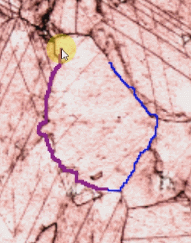
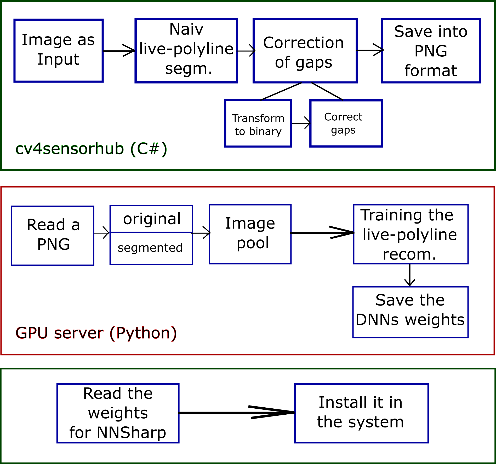

# CV4RLframework documentation

## Contents
* [cv4sensorhub](#cv4sensorhub)
* [A special tool live-polyline](#a-special-tool-live-polyline)
* [Structure of the RL framework](#structure-of-the-rl-framework)

### cv4sensorhub

[cv4sensorhub](http://bmeaut.github.io/cv4sensorhub/) is an environment for interdisciplinary image processing tasks. The CV4RLframework connects to a special image processing problem, namely to live-polylines. 

### A special tool live-polyline

In this picture the background is a marble thin section image. The goal of the image processing in this case is to find the exact boundaries of the grains. This is important for experts to draw conclusions like the provenance of the sample etc. Traditionally the segmenting process is done manually but cv4sensorhub provides algorithms to this on a semi-automatic way. A part of this process to correct the wrong segmenting curves at the end or do the whole segmentation manually in case of difficult images. 

Live-polyline is a special drawing tool to help this. The only thing the user should do is to click somewhere in the border of a grain then move the mouse to another point of the border. The live-polyline algorithm will propose a curve which connects these two points by folowing the border of the grain. After a new click the recommended curve is finalized. With this tool the user does not have to draw the segmenting curves entirely but clicking on right places and the remaining work is done by the algorithm. 

### Structure of the RL framework

The recommendation process uses reinforcement learning to develop better recommendation strategies. This documentation shows the structure of the framework but not algorithm.

The top module shows the block diagram of the process which generates training pictures for the algorithm. The perfect solutions are created manually. The live-polyline algorithm has a naiv implementation which does not use machine learning but can help drawing the border lines easier. To join the curve pieces where they meet the gaps are searched and replaced with lines. 

The training is computationally demanding therefore it is delegated to a different server. The best tools for neural network training are written in Python so the training part was also written in Python. The basic idea is to use more pictures at once in order to force the algorithm to learn how to cope with images which have different characteristics. 

At the end the weights of the neural network is saved then refilled on the C# side. 

